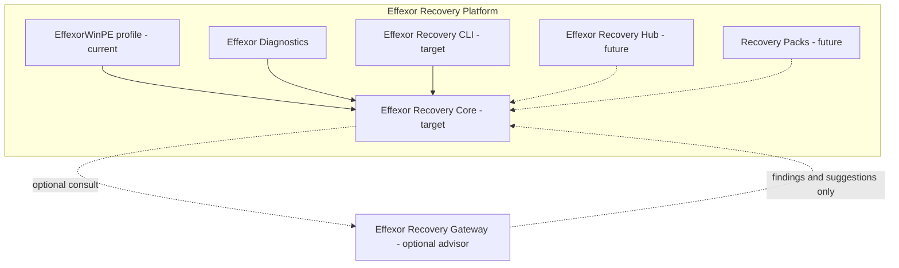
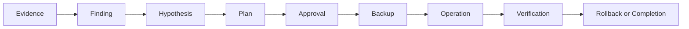

# Architecture overview v2 — Effexor Recovery Platform

Status: **target architecture documentation**. Runtime code in this repository
still matches the EffexorWinPE MVP described in [`../architecture.md`](../architecture.md).
This document does not change process layout, schemas, or executables.

## Product vs profile

**EffexorWinPE ≠ entire product.** It is the current boot/runtime profile that
hosts today’s collector, agent client, shell, and WinPE media build.

## Trust and authority

| Zone | Authority |
|------|-----------|
| Local Recovery Core / on-device policy | **Authoritative** for what may run |
| Technician Approval | **Required** for mutation |
| Effexor Diagnostics / CLI / UI | Presentation and requests only; cannot bypass policy |
| Effexor Recovery Gateway | **Advisory only**; no local authority |
| Model provider | No direct device access |

## Recovery loop

Today’s implemented path is concentrated on **Evidence** and conservative
**Finding** / read-only next steps, plus optional gateway-assisted findings that
remain non-authoritative. Recovery domain contracts, a legacy diagnostic-report
importer, and a local **Case Store** library (immutable snapshots + append-only
commits) exist. A **Recovery Coordinator** library (PR #17, on main) orchestrates
create/resume and early workflow transitions over the Case Store. **PR #18**
adds an advisory Windows boot topology resolver, a typed read-only operation
registry (Case snapshot evidence + Case Store integrity verify), and incremental
evidence acquisition with provenance records. **Draft PR #19** adds deterministic
Boot Doctor analysis (`internal/recovery/bootdoctor`) that turns topology + Case
Evidence into typed Findings only — still no mutation, live reinspection, planner,
backup, or LLM authority. `mutation_eligibility` on topology facts is diagnostic
completeness only; it is **not** approval or safe-to-repair authority. Findings are
not approvals either. Neither acquisition nor Boot Doctor is wired into WinPE
runtime or GUI yet. Mutation, backup, and verification remain **not** shipped.

## Component mapping (legacy-compatible)

| Current artifact | Platform role |
|------------------|---------------|
| `effexorwinpe-collector` | Evidence collection (must stay non-mutating) |
| `effexorwinpe-agent` | Offline preflight / session / gateway client |
| `effexorwinpe-shell` | Effexor Diagnostics UI in WinPE |
| `effexorwinpe-gateway` | Effexor Recovery Gateway |
| `build/Build-WinPE.ps1` | EffexorWinPE profile image build |
| `contracts/*.schema.json` | Current versioned contracts (evolve later; unchanged in this PR) |

These names remain valid. Reframing does not deprecate them for deletion.

## Absolute prohibitions

1. No raw model commands.
2. Collector cannot mutate.
3. Analyzer cannot execute.
4. UI cannot bypass policy.
5. Mutation without verification is incomplete.
6. External gateway has no local authority.

## First vertical

**Boot Doctor** is the first product vertical to build on Core contracts. It is
a roadmap commitment, not a shipped module.

## Desktop shell

Desktop shell is an **optional parallel UX track** that may host Diagnostics
inside a fuller WinPE desktop. It is experimental and must not block Recovery
Core delivery. See [`../adr/0005-desktop-shell-optional.md`](../adr/0005-desktop-shell-optional.md).

## Related ADRs

- [0001 Product boundary](../adr/0001-product-boundary.md)
- [0002 Local authority](../adr/0002-local-authority.md)
- [0003 Typed operations](../adr/0003-typed-operations.md)
- [0004 Evidence before action](../adr/0004-evidence-before-action.md)
- [0005 Desktop shell optional](../adr/0005-desktop-shell-optional.md)
