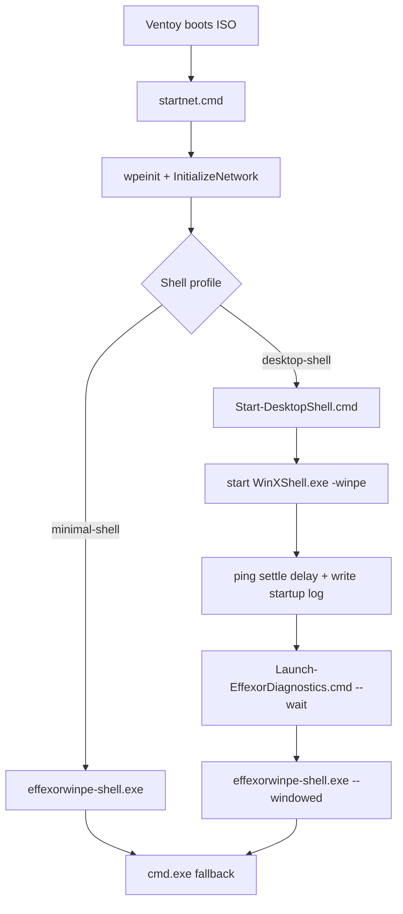

## Summary

- adds an opt-in `desktop-shell` build profile alongside the default `minimal-shell` profile
- keeps the release ISO untouched while routing the experimental profile to `EffexorWinPE-Desktop-Spike-amd64.iso`
- adds WinXShell manifest-first gating, desktop bootstrap logging, automatic Diagnostics launch, taskbar-visible windowed mode, relaunch entries, and `cmd.exe` fallback

## Screenshots

Placeholders until physical or VM validation is available:

- [ ] Ventoy boot selection
- [ ] Desktop-shell after WinXShell start
- [ ] Effexor Diagnostics visible in taskbar
- [ ] Diagnostics relaunched after close
- [ ] Any startup error dialogs

Suggested storage: `out/local-validation/desktop-shell-spike/` (do not commit generated images).

## Architecture diagram

## License review

- candidate source: `slorelee/PExplorer` branch `WinXShell_shellpart`
- exact researched revision: `5f8b886f326e706e6e4bba0e0b15da7da344857e`
- declared license: LGPL-2.1
- tracked notice: `third_party/winxshell/LICENSE.upstream-LGPL-2.1.txt`
- redistribution status: **Hold** until a reproducible local build or strict artifact intake is completed and the staged binary hash is recorded
- explicitly excluded: Strelec bundles, opaque WinXShell packs, `explorer.exe`, and copied Windows system DLLs

## Memory comparison

See `docs/desktop-shell-metrics.md`.

Current status:

| Metric | minimal-shell | desktop-shell | Notes |
|--------|---------------|---------------|-------|
| boot.wim size | TBD | TBD | requires ADK build |
| ISO size | TBD | TBD | requires ADK build |
| Ventoy launch to desktop | TBD | TBD | physical test required |
| Free RAM after boot | TBD | TBD | physical test required |
| Shell working set | TBD | TBD | physical test required |
| Effexor Diagnostics working set | TBD | TBD | physical test required |
| Process list | TBD | TBD | physical test required |
| Startup errors | TBD | TBD | physical test required |

## Known limitations

- no approved `WinXShell.exe` artifact is staged in this repo yet
- reproducible local build of the shellpart is not completed from this workspace
- shell features like wallpaper, tray/clock, start menu, desktop icons, file manager, and reboot/shutdown are expected from WinXShell but not yet validated end-to-end here
- `desktop-shell` remains blocked when manifest `sha256` is `TBD`, `redistribution_status=hold`, the binary is absent, the hash mismatches, or the manifest license file is missing
- screenshots remain placeholders until physical or VM smoke runs

## Physical test checklist

- [ ] Build `minimal-shell` ISO
- [ ] Build `desktop-shell` ISO with staged `WinXShell.exe`
- [ ] Confirm experimental ISO name is `EffexorWinPE-Desktop-Spike-amd64.iso`
- [ ] Boot both from Ventoy on the same machine
- [ ] Measure time to interactive desktop
- [ ] Capture free RAM, working set, and process list
- [ ] Confirm Diagnostics is visible in the taskbar
- [ ] Confirm Diagnostics can be closed and relaunched
- [ ] Confirm `cmd.exe` fallback remains available
- [ ] Confirm reboot/shutdown path from shell
- [ ] Record startup errors, if any

## Rollback path

1. Rebuild with `-ShellProfile minimal-shell`
2. Use the unchanged release ISO `EffexorWinPE-amd64.iso`
3. Remove the staged `WinXShell.exe` artifact from `third_party/winxshell/`

## Test plan

- [x] `git fetch origin`
- [x] confirmed branch exists on remote
- [x] confirmed spike branch is already based on `origin/main`
- [x] run `build/Test-DesktopShellSpike.ps1` (`PASS`)
- [x] run `build/Test-Repository.ps1` (`PASS`)
- [x] upstream feasibility audit (`out/local-validation/winxshell-build-audit/REPORT.md`) → **GO**
- [x] reproducible local x64 build of open shellpart + `notifyhook.dll` (`local_test_only`)
- [ ] run `build/Build-WinPE.ps1 -ShellProfile minimal-shell`
- [ ] run `build/Build-WinPE.ps1 -ShellProfile desktop-shell` (needs elevated PowerShell / ADK)
- [ ] ADK desktop build
- [ ] screenshots
- [ ] metrics
- [ ] physical Ventoy smoke
- [ ] perform physical Ventoy smoke and fill metrics table

Do not merge until physical Ventoy smoke of experimental ISO.
