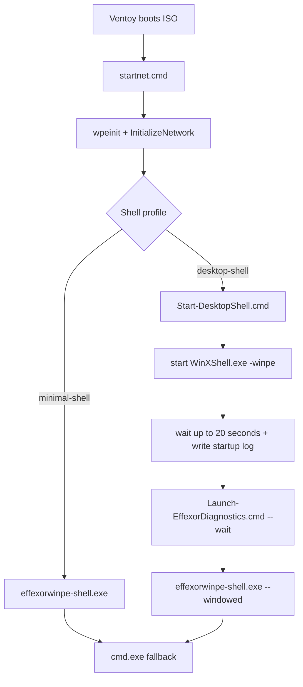

# WinPE desktop-shell spike

Research and build scaffolding for an optional WinPE desktop shell. This does
**not** change the default release image.

## Profiles

| Profile | ISO name | Autostart | Third-party shell |
|---------|----------|-----------|-------------------|
| `minimal-shell` (default) | `EffexorWinPE-amd64.iso` | `effexorwinpe-shell.exe` then `cmd.exe` | none |
| `desktop-shell` (experimental) | `EffexorWinPE-Desktop-Spike-amd64.iso` | desktop bootstrap starts WinXShell, waits for shell startup, logs the result, then launches Effexor Diagnostics in windowed mode before `cmd.exe` fallback | only if staged under `third_party/winxshell/` |

Build:

```powershell
# Release path (unchanged)
.\build\Build-WinPE.ps1 -UILanguage ru-RU

# Experimental spike (requires staged binary + provenance)
.\build\Build-WinPE.ps1 -UILanguage ru-RU -ShellProfile desktop-shell
```

## Current spike architecture



Desktop-shell intentionally keeps Effexor Diagnostics as the technician-facing
app. The desktop shell is only a host surface that can provide wallpaper,
taskbar, tray/clock, start menu, desktop icons, file manager, and power actions
once a vetted WinXShell build is staged.

## License gate

Before any experimental ISO is shared outside the lab:

1. Confirm the binary was built from LGPL-2.1 sources (PExplorer `WinXShell_shellpart`
   or an equivalent documented fork).
2. Record the tracked `license_file` path in `third_party/winxshell/MANIFEST.json`.
   `Build-WinPE.ps1` copies that file into the WIM beside the binary as
   `LICENSE.LGPL-2.1.txt`.
3. Record source URL, commit/tag, build host, and human-readable SHA-256 notes in
   `third_party/winxshell/PROVENANCE.md`.
4. Do **not** redistribute closed-source WinXShell UI component packs.
5. Keep `third_party/winxshell/MANIFEST.json` aligned with the exact revision,
   license file, and staged artifact hash.

See [ADR 0002](decisions/0002-winpe-desktop-shell-spike.md).

## Staging layout (gitignored binaries)

```
third_party/winxshell/
  MANIFEST.json          # tracked manifest required by AGENTS.md third-party rules
  PROVENANCE.md          # required, tracked
  LICENSE.upstream-LGPL-2.1.txt
  WinXShell.exe          # gitignored; checksum-pinned in PROVENANCE.md
```

`Build-WinPE.ps1 -ShellProfile desktop-shell` fails closed if the binary or
manifest hash is missing. It also requires:

- a non-`TBD` manifest `sha256`
- `redistribution_status` other than `hold`
- a present `WinXShell.exe`
- a matching binary hash
- a manifest `license_file` that exists in the repo

During image assembly the tracked manifest license file is copied into the WIM
under the stable name `LICENSE.LGPL-2.1.txt`.

## What the spike implements now

- Two build profiles: `minimal-shell` and `desktop-shell`
- Separate experimental ISO name: `EffexorWinPE-Desktop-Spike-amd64.iso`
- Third-party provenance gate for `WinXShell.exe`
- Tracked third-party manifest and upstream LGPL notice
- Desktop-shell startup path that:
  - starts WinXShell first
  - waits for the process to appear with a bounded timeout
  - records desktop startup events to `X:\EffexorWinPE\reports\desktop-shell-startup.log`
  - launches Effexor Diagnostics automatically
  - runs Diagnostics with `--windowed` so it can remain visible in the taskbar
  - drops to `cmd.exe` after Diagnostics exits
- `Launch-EffexorDiagnostics.cmd` helper inside the image so Diagnostics can be
  relaunched manually from the shell, file manager, or `cmd.exe`
- Desktop and Start Menu launcher entries for `X:\EffexorWinPE\Launch-EffexorDiagnostics.cmd`

## Required but not yet validated here

These capabilities are expected from the vetted PExplorer / WinXShell shellpart
itself, but they are **not validated in this workspace** because no approved
binary or reproducible local build is currently staged:

- wallpaper
- taskbar
- tray / clock
- start / application menu
- desktop icons
- file manager
- reboot / shutdown integration

`cmd.exe` fallback is implemented regardless of third-party shell validation.

## Diagnostics behavior

- `minimal-shell`: Diagnostics runs fullscreen/kiosk as today.
- `desktop-shell`: Diagnostics launches automatically with `--windowed` so it
  can be closed without killing the desktop shell and can remain visible in the
  taskbar while the shell stays active.
- Relaunch path: `X:\EffexorWinPE\Launch-EffexorDiagnostics.cmd`
- Launcher entries:
  - `X:\Users\Default\Desktop\Effexor Diagnostics.cmd`
  - `X:\ProgramData\Microsoft\Windows\Start Menu\Programs\Effexor Diagnostics.cmd`

No UI redesign is included in this spike.

## Metrics

See [desktop-shell-metrics.md](desktop-shell-metrics.md) for the required table,
physical measurement steps, and merge gate placeholders.

## License review

- Candidate source line: `slorelee/PExplorer` branch `WinXShell_shellpart`
- Exact researched revision:
  `5f8b886f326e706e6e4bba0e0b15da7da344857e`
- Declared license: LGPL-2.1
- Local notice tracked at:
  `third_party/winxshell/LICENSE.upstream-LGPL-2.1.txt`
- Redistribution status: **Hold** until:
  - reproducible build notes or strict artifact intake are completed
  - `LICENSE.LGPL-2.1.txt` is staged beside the actual binary
  - SHA-256 is recorded in both manifest/provenance
  - physical Ventoy smoke passes

## Rollback

1. Rebuild with `-ShellProfile minimal-shell` (default), or
2. Boot the last known-good release ISO (`EffexorWinPE-amd64.iso`).

Emergency console: `cmd.exe` still starts after the GUI exits on both profiles.

## Validation checklist (lab)

- [ ] `minimal-shell` ISO still boots; Effexor GUI + Esc + cmd fallback work.
- [ ] `desktop-shell` ISO boots only with pinned binary present.
- [ ] Desktop shell starts under WinPE (`-winpe` or documented flag).
- [ ] Desktop shell keeps taskbar/tray/clock visible after Diagnostics auto-launch.
- [ ] `Launch-EffexorDiagnostics.cmd` relaunches Diagnostics after the first close.
- [ ] Effexor GUI still launches and remains usable (mouse + keyboard).
- [ ] Record peak working-set / free RAM vs `minimal-shell` on the same VM.
- [ ] Screenshot set under `out/local-validation/desktop-shell-spike/` (not committed).
- [ ] Confirm no secrets or non-LGPL blobs entered the image.
- [ ] Do not merge until physical Ventoy smoke of `EffexorWinPE-Desktop-Spike-amd64.iso`.

## Known limitations

- Desktop shells typically cost more RAM than kiosk Win32 UI alone; measure on a
  2–4 GB WinPE VM before recommending physical use.
- Mixing a third-party shell with our fullscreen Win32 UI can recreate input-focus
  issues; treat coexistence as part of the spike, not an assumed success.
- Opaque community binaries are rejected until provenance matches AGENTS.md
  third-party rules.
- `WinXShell.exe` is not staged in this repo, so the experimental ISO cannot be
  produced yet from this checkout.
- Reproducible local build instructions for the shellpart are still incomplete;
  artifact intake remains the current documented fallback.
- Screenshots in this doc remain placeholders until physical or VM validation is run.
